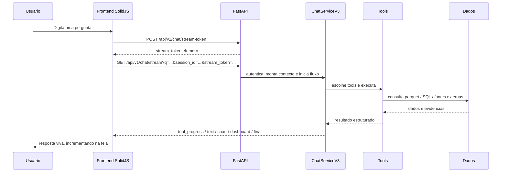

# Caculinha BI - Tour do Sistema

Atualizado em: 2026-03-07

## Antes de tudo

Este nao e um documento para catalogar pasta por pasta.
Ele existe para responder a pergunta que todo mundo novo faz:

> "Como esse sistema pensa, por onde uma requisicao passa e onde eu entro sem me perder?"

Se voce ler so este arquivo e abrir os pontos indicados no codigo, ja consegue conversar sobre o sistema com propriedade.

## Minidicionario do projeto

Se alguem do time nao for tecnico, ou ainda estiver entrando no assunto, esta tabela evita que a conversa fique travada em jargao.

| Termo | Em linguagem comum | Por que isso importa |
|---|---|---|
| Tenant | um contexto interno da propria Caçula dentro do sistema | o sistema precisa saber em qual recorte interno da Caçula esta operando |
| Contexto por tenant | o sistema "lembrar" em qual contexto interno da Caçula ele esta trabalhando naquele momento | isso define configuracoes, limites e, em alguns casos, quais dados podem aparecer |
| JWT | um cracha digital do usuario | e como o backend reconhece quem esta fazendo a requisicao |
| Middleware | uma etapa da portaria da aplicacao | antes da requisicao chegar na logica principal, ela passa por essas checagens |
| Stream SSE | uma resposta que vai chegando aos poucos, em vez de vir tudo no final | e isso que faz o chat parecer vivo e progressivo |
| Tool | uma funcao especializada | e a "mao na massa" que consulta dado, gera grafico ou pesquisa mercado |
| Session ID | o codigo da conversa atual | serve para o sistema lembrar o historico daquela sessao |
| Rate limit | limite de uso por tempo | protege o sistema contra abuso e sobrecarga |
| Role | o perfil do usuario, como admin ou viewer | ajuda a decidir o que cada pessoa pode acessar |
| Recorte por segmento | um filtro de acesso aos dados | impede que o usuario veja o que nao deveria |
| Dashboard spec | a receita que diz como montar um dashboard | o backend nao manda so um desenho pronto; ele manda a estrutura para o frontend renderizar |
| Parquet | um arquivo de dados otimizado para analise | hoje ele e a principal fonte operacional do sistema |

## Se voce precisar explicar o sistema em 2 minutos

O Caculinha BI e uma plataforma de BI conversacional para varejo.

Na pratica, ela faz 5 coisas ao mesmo tempo:

1. autentica o usuario e entende qual perfil ele tem;
2. identifica o tenant, ou seja, em qual contexto interno da Caçula a resposta esta sendo gerada;
3. recebe perguntas em linguagem natural pelo chat;
4. consulta dados reais, monta graficos e dashboards, e pode buscar evidencia de mercado;
5. devolve a resposta em stream, ou seja, aos poucos, como texto, tabela, grafico ou dashboard.

Se voce lembrar de apenas 5 ideias, lembre destas:

- o frontend nao espera uma resposta unica; ele abre um stream SSE, que faz a resposta chegar em partes;
- o backend passa pela "portaria" antes de chegar na logica: observability, rate limit, tenant e auth;
- o `ChatServiceV3` e o maestro do fluxo principal do chat;
- as tools sao quem realmente consulta dados, gera visualizacao e faz pesquisa;
- o dado principal do sistema vem do parquet `admmat.parquet`, um arquivo de dados voltado para analise.

## Como pensar o sistema

Uma forma simples de guardar a arquitetura na cabeca:

| Camada | Papel no sistema | Onde olhar primeiro |
|---|---|---|
| Interface | Onde o usuario navega, faz login e conversa com o chat | `frontend-solid/src/index.tsx`, `frontend-solid/src/pages/Chat.tsx` |
| Portaria | Onde a requisicao ganha contexto, limite e identidade antes de entrar na regra de negocio | `backend/main.py`, `backend/app/api/middleware/` |
| API | Onde as rotas entram e saem do backend | `backend/app/api/v1/router.py` |
| Orquestracao | Onde a pergunta vira plano de execucao | `backend/app/api/v1/endpoints/chat.py`, `backend/app/services/chat_service_v3.py` |
| Ferramentas e dados | Onde a resposta realmente e produzida | `backend/app/core/tools/`, `backend/data/parquet/admmat.parquet` |

Se preferir uma imagem mental mais intuitiva:

- o frontend e o cockpit;
- os middlewares sao a portaria;
- o `ChatServiceV3` e o maestro;
- as tools sao os especialistas;
- o parquet e a fonte de verdade operacional.

## A historia mais importante do sistema

O fluxo mais importante deste projeto nao e "abrir pagina".
E este:

**uma pergunta vira insight operacional em tempo real**



Se o time entender esse desenho, ele entende o coracao do produto.

## O caminho de uma pergunta real

Vamos usar uma pergunta tipica:

> "Mostre um dashboard do segmento ARTES com os principais produtos e risco de ruptura."

O que acontece:

1. o usuario ja esta autenticado;
2. o frontend valida a sessao e pede um `stream_token`;
3. o frontend abre o SSE em `/api/v1/chat/stream`;
4. o backend autentica esse stream e recupera o usuario;
5. o sistema aplica contexto interno, role e segmentos permitidos;
6. o `ChatServiceV3` aciona o fluxo de orquestracao;
7. o roteamento identifica que nao basta texto: ha intencao de dashboard;
8. as tools consultam os dados, montam o payload e devolvem `dashboard_spec`;
9. o frontend renderiza esse dashboard no proprio chat;
10. o `session_id`, que e o codigo da conversa, preserva o contexto entre mensagens.

Traduzindo o passo 5 para linguagem comum:

- o sistema descobre em qual contexto interno da Caçula esta respondendo;
- confirma qual tipo de usuario esta fazendo a pergunta;
- e aplica os limites de acesso antes de buscar os dados.

Arquivos-chave desse caminho:

- `frontend-solid/src/pages/Chat.tsx`
- `backend/app/api/v1/endpoints/chat.py`
- `backend/app/api/dependencies.py`
- `backend/app/services/chat_service_v3.py`
- `backend/app/core/utils/query_router.py`
- `backend/app/core/tools/`

## O que o usuario enxerga x o que o sistema esta fazendo

| O usuario acha que aconteceu | O que de fato aconteceu no sistema |
|---|---|
| "o chat respondeu" | houve auth, tenant, rate limit, roteamento, execucao de tools e stream incremental |
| "o grafico apareceu" | uma tool gerou `chart_spec` ou um `dashboard_spec` valido |
| "o sistema conhece meu contexto" | o backend carregou `session_id`, dados do token e recortes de acesso |
| "deu erro no chat" | o stream falhou, o token expirou, a tool nao encontrou dados ou houve bloqueio por recorte |

Essa diferenca importa porque quase todo bug aparece exatamente nesse espaco entre percepcao do usuario e comportamento real.

## As 3 portas de entrada que todo mundo precisa dominar

### 1. Login e sessao

Aqui nasce a identidade do usuario.

Arquivos principais:

- `backend/app/api/v1/endpoints/auth.py`
- `backend/app/api/dependencies.py`
- `frontend-solid/src/index.tsx`

O que precisa ficar claro:

- `POST /api/v1/auth/login` entrega `access_token` e `refresh_token`;
- `GET /api/v1/auth/me` e a validacao mais simples de sessao;
- admin recebe `allowed_segments=["*"]`;
- o frontend depende disso para liberar rotas protegidas.

Traducao rapida:

- `access_token`: cracha digital para usar agora;
- `refresh_token`: forma de renovar esse cracha sem novo login;
- `allowed_segments`: lista do que esse usuario pode enxergar.

### 2. Stream do chat

Aqui nasce a experiencia principal do produto.

Arquivos principais:

- `frontend-solid/src/pages/Chat.tsx`
- `backend/app/api/v1/endpoints/chat.py`

O que precisa ficar claro:

- o frontend nao manda a pergunta e espera parado;
- ele pede um token efemero, ou seja, um passe curto e temporario, e depois abre `EventSource`;
- o backend responde em eventos como `tool_progress`, `text`, `chart`, `table`, `dashboard` e `final`;
- `POST /api/v1/chat` ainda existe, mas o fluxo principal e o SSE.

### 3. Dados e tools

Aqui mora a verdade da resposta.

Arquivos principais:

- `backend/app/core/tools/`
- `backend/data/parquet/admmat.parquet`
- `docs/CHATBI_TOOL_CONTRACTS.md`

O que precisa ficar claro:

- a resposta final depende do conjunto de tools disponiveis para o perfil;
- parte do recorte e controlada por `allowed_segments`;
- nem toda pergunta vira texto: algumas viram tabela, grafico ou dashboard.

Traducao rapida:

- tool = uma funcao especializada;
- perfil = o tipo de usuario;
- recorte = o limite do que pode ser mostrado.

## A portaria do sistema

Antes da feature acontecer, a requisicao passa por uma camada que define o comportamento inteiro.

Ponto de entrada:

- `backend/main.py`

Ordem efetiva de entrada:

1. `ObservabilityMiddleware`
2. `RateLimitMiddleware`
3. `TenantMiddleware`
4. `AuthMiddleware`

O que cada um decide:

| Middleware | Pergunta que ele responde |
|---|---|
| Observability | "Como vou rastrear esta requisicao?" |
| Rate limit | "Este usuario ainda pode usar o sistema agora?" |
| Tenant | "Em qual contexto interno da Caçula este pedido deve rodar?" |
| Auth | "Quem e este usuario e o que ele pode fazer?" |

Em linguagem comum:

- `TenantMiddleware` responde "em qual contexto interno da Caçula esta conversa esta rodando?";
- `AuthMiddleware` responde "quem esta falando com o sistema?";
- `RateLimitMiddleware` responde "essa pessoa ainda pode usar mais agora?".

Se voce mexer em chat sem entender essa ordem, vai diagnosticar bug no lugar errado.

## Mapa do territorio

### Onde comecar quando voce quer entender o sistema

| Se voce quer entender... | Comece aqui |
|---|---|
| navegacao e rotas | `frontend-solid/src/index.tsx` |
| tela principal do produto | `frontend-solid/src/pages/Chat.tsx` |
| como as rotas do backend se organizam | `backend/app/api/v1/router.py` |
| como o chat entra no backend | `backend/app/api/v1/endpoints/chat.py` |
| como a pergunta vira execucao | `backend/app/services/chat_service_v3.py` |
| regras de acesso por perfil | `backend/app/api/middleware/auth.py`, `docs/adr/ADR-004-rbac-capability-scoping.md` |
| contrato das ferramentas | `docs/CHATBI_TOOL_CONTRACTS.md` |

### Onde estao as partes mais quentes

Partes quentes sao as que mais concentram bug, regressao ou acoplamento:

- `frontend-solid/src/pages/Chat.tsx`
- `backend/app/api/v1/endpoints/chat.py`
- `backend/app/services/chat_service_v3.py`
- `backend/app/core/utils/query_router.py`
- `backend/app/core/tools/`

### Onde estao as partes mais perigosas

Partes perigosas sao as que exigem cuidado extra por risco tecnico ou legado:

- `backend/app/api/v1/endpoints/auth_alt.py`
- coexistencia de rotas e fluxos novos com legados;
- caches e limites em memoria;
- dependencias externas de LLM e pesquisa de mercado;
- qualquer mudanca em recorte por segmento ou permissao por role.

Traduzindo:

- legado = algo antigo que ainda funciona, mas exige cuidado;
- permissao por role = o que muda entre admin, analyst, viewer e outros perfis;
- recorte por segmento = a cerca que protege quem pode ver qual fatia dos dados.

## O dado que sustenta o sistema

O principal ativo operacional do projeto hoje e:

- `backend/data/parquet/admmat.parquet`

Em torno dele, o sistema entrega:

- consulta tabular;
- agregacao;
- grafico;
- dashboard;
- analise operacional por contexto.

Complementos:

- SQL Server pode ser habilitado por configuracao;
- SQLite aparece como fallback tecnico em partes do sistema;
- usuarios podem vir de fluxo local e de fluxo compatibilizado por token.

## Como subir o sistema sem drama

### Caminho recomendado no Windows

```bat
START_SYSTEM_V2026.bat
```

Esse script faz o trabalho chato:

- valida Python e Bun;
- cria `backend/.env` quando necessario;
- verifica o parquet principal;
- sobe backend na porta `8000`;
- espera `GET /health` responder;
- sobe frontend na porta `3000`.

### Quando voce quer subir manualmente

Backend:

```powershell
pip install -r backend/requirements.txt
$env:WATCHFILES_FORCE_POLLING='true'
python -m uvicorn backend.main:app --host 0.0.0.0 --port 8000 --reload --reload-dir backend --reload-include *.py --reload-include .env
```

Frontend:

```powershell
cd frontend-solid
bun install
bun run dev -- --host 127.0.0.1 --port 3000
```

## Como saber se esta tudo vivo

Use este mini roteiro:

1. `GET /health` responde `200`;
2. login em `POST /api/v1/auth/login` funciona;
3. `GET /api/v1/auth/me` devolve o usuario atual;
4. o chat consegue gerar `stream_token`;
5. uma pergunta simples devolve `text` e `final`.

Se isso funciona, o esqueleto principal do produto esta de pe.

## O que vale testar antes de mexer em coisa sensivel

Testes uteis para onboarding e para smoke check:

- `pytest backend/tests -q`
- `pytest backend/tests/integration/test_chat_metrics_integration.py -v`
- `cd frontend-solid && bun run test`
- `cd frontend-solid && bun run test:e2e`

Leituras auxiliares:

- `backend/tests/README_TESTS.md`
- `docs/CHATBI_TEST_CASES.md`

## O que faz esse projeto ser interessante

Este sistema nao e apenas um CRUD com chat em cima.

O que o torna interessante:

- a resposta nasce em stream, nao em bloco;
- o chat pode devolver interface, nao so texto;
- a governanca passa por role, tenant e recorte de dados;
- existe um equilibrio delicado entre experiencia de produto e confiabilidade operacional;
- parte do valor esta em juntar dado interno com evidencia externa sem perder controle.

## Primeiro passeio recomendado de 30 minutos

Se eu fosse colocar uma pessoa nova para entender o sistema sem afogar ela, faria assim:

1. ler este documento inteiro;
2. abrir `frontend-solid/src/index.tsx` e entender as rotas;
3. abrir `frontend-solid/src/pages/Chat.tsx` e localizar `stream-token` e `EventSource`;
4. abrir `backend/app/api/v1/endpoints/chat.py` e encontrar `/stream-token` e `/stream`;
5. abrir `backend/main.py` e ver a ordem dos middlewares;
6. abrir `docs/CHATBI_TOOL_CONTRACTS.md` para entender o que o chat realmente pode fazer.

Depois disso, a pessoa para de ver o projeto como "um monte de pasta" e comeca a ver o fluxo real.

## Leituras seguintes

Depois deste tour, a ordem mais eficiente e:

1. `README.md`
2. `docs/adr/ADR-004-rbac-capability-scoping.md`
3. `docs/adr/ADR-005-dashboard-chat-first.md`
4. `docs/CHATBI_TOOL_CONTRACTS.md`
5. `docs/ONBOARDING_7_DIAS.md`
