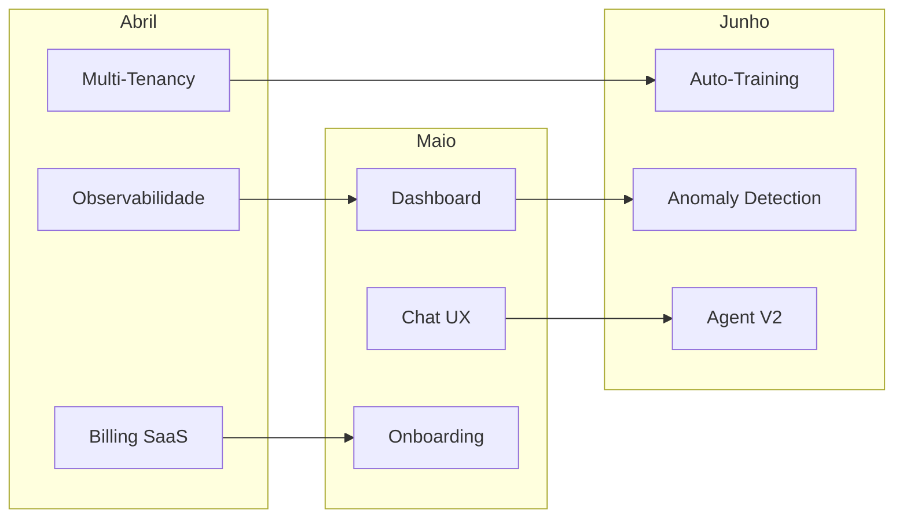

# Roadmap Trimestral Q2 2026

**Projeto:** Caculinha BI Enterprise AI Platform  
**Período:** Abril — Junho 2026  
**Agente Líder:** Project Planner

---

## Visão do Trimestre

Consolidar a plataforma enterprise com foco em **escalabilidade SaaS**, **observabilidade avançada** e **autonomia operacional**.

---

## Mês 1 — Abril 2026

### Tema: **Robustez Operacional**

| Iniciativa | Descrição | Agentes | Risco |
|------------|-----------|---------|-------|
| **Observabilidade Completa** | OpenTelemetry + Grafana + Alertas | Backend, DevOps | Médio |
| **Billing SaaS** | Integração Stripe + Planos + Quotas | Backend, Security | Alto |
| **Multi-Tenancy Hardening** | Isolamento de dados por tenant | Security, Backend | Alto |

**Dependências:**
- Pipeline Cognitivo (FASE 6) deve estar estável
- JWT Middleware operacional

**Riscos:**
- ⚠️ Billing complexo pode atrasar
- ⚠️ Isolamento de tenant requer testes extensivos

---

## Mês 2 — Maio 2026

### Tema: **Experiência do Usuário**

| Iniciativa | Descrição | Agentes | Risco |
|------------|-----------|---------|-------|
| **Dashboard Analytics** | Visualizações interativas (D3/Chart.js) | Frontend | Médio |
| **Chat UX Premium** | Streaming, markdown, code blocks | Frontend | Baixo |
| **Onboarding Flow** | Wizard de setup + tour guiado | Frontend, Backend | Médio |

**Dependências:**
- APIs estáveis do Mês 1
- Billing para controle de features por plano

**Riscos:**
- ⚠️ UX complexa pode impactar performance
- ⚠️ Onboarding requer conteúdo de ajuda

---

## Mês 3 — Junho 2026

### Tema: **Inteligência Autônoma**

| Iniciativa | Descrição | Agentes | Risco |
|------------|-----------|---------|-------|
| **Auto-Training Pipeline** | Feedback loop + fine-tuning | Backend, ML | Alto |
| **Anomaly Detection** | Detecção proativa de rupturas | Backend | Médio |
| **Agent Orchestration V2** | Multi-agent paralelo | Orchestrator | Alto |

**Dependências:**
- Feature Store operacional (FASE 7)
- Volume de feedback suficiente

**Riscos:**
- ⚠️ Fine-tuning requer infra GPU
- ⚠️ Multi-agent pode introduzir complexidade

---

## Diagrama de Dependências

---

## Marcos (Milestones)

| Marco | Data | Critério de Sucesso |
|-------|------|---------------------|
| **M1: Observability Ready** | 15/04/2026 | Dashboards Grafana ativos |
| **M2: Billing Live** | 30/04/2026 | Primeiro pagamento processado |
| **M3: Dashboard MVP** | 15/05/2026 | 5 visualizações funcionais |
| **M4: Onboarding Complete** | 31/05/2026 | NPS > 4.0 em testes |
| **M5: Auto-Training V1** | 15/06/2026 | Pipeline executando |
| **M6: Q2 Complete** | 30/06/2026 | Todos OKRs atingidos |

---

## Alocação de Recursos

| Agente | Abril | Maio | Junho |
|--------|-------|------|-------|
| Backend Specialist | 80% | 40% | 60% |
| Frontend Specialist | 20% | 80% | 20% |
| Security Auditor | 60% | 20% | 20% |
| Orchestrator | 20% | 20% | 60% |
| Debugger | On-demand | On-demand | On-demand |

---

**Próxima Revisão:** 01/04/2026
